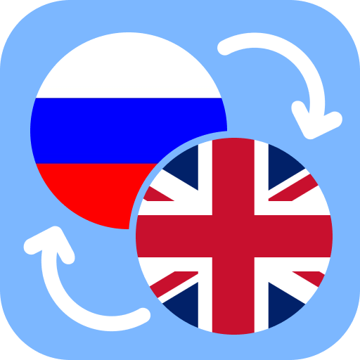
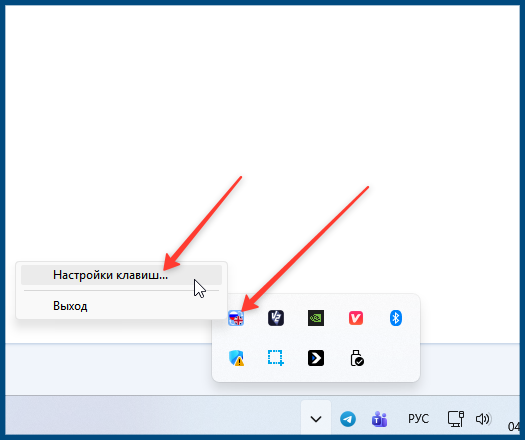
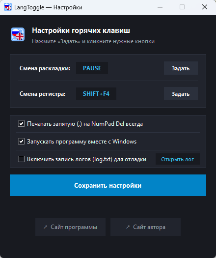

  

  # LangToggle

 **Лёгкая и быстрая утилита для смены раскладки и регистра выделенного текста в любой программе Windows.**

  
  
  
  

---

## 💡 О проекте

Знакома ситуация, когда напечатали предложение, не глядя на экран, и вместо **«Привет, как дела?»** получилось **«Ghbdtn, rfr ltkf?»**?

**LangToggle** решает эту проблему мгновенно. Выделите ошибочный текст в **любой программе** (браузер, Telegram, Word, Блокнот, IDE) и нажмите одну клавишу — текст будет исправлен на лету!

---

## ✨ Ключевые возможности

- 🔄 **Мгновенная смена раскладки (RU ↔ EN):** 
  Исправляет текст с сохранением регистра и всех знаков препинания (`?`, `/`, `,`, `.`).
- 🔠 **Смена регистра по кругу:** 
  Переключает регистр выделенного фрагмента между `ВЕРХНИЙ` и `нижний` в один клик.
- ⌨️ **Киллер-фича: умная запятая на NumPad:** 
  Клавиша `Del / .` на цифровом блоке теперь всегда печатает удобную запятую `,` независимо от языка системы (можно отключить в настройках).
- 🎨 **Современный Fluent Dark интерфейс:** 
  Красивое окно настроек с поддержкой темной темы Windows 11, открывающееся строго по центру экрана.
- ⚙️ **Полная кастомизация клавиш:** 
  Любое действие можно переназначить на свою удобную комбинацию прямо в окне настроек.
- 🚀 **Тихий автозапуск:** 
  Программа умеет запускаться вместе с Windows без лишних окон и навязчивых уведомлений.
- 🛡️ **Безопасность и приватность:** 
  Не требует прав администратора, не портит буфер обмена скриншотов и работает автономно без интернета.
- 📦 **100% Portable:** 
  Единый `.exe`-файл весом всего ~18 МБ, не требующий установки Python и сторонних библиотек.

---

## ⌨️ Горячие клавиши по умолчанию

| Действие | Клавиша по умолчанию | Описание |
| :--- | :---: | :--- |
| **Смена раскладки** | `Pause / Break` | `ghbdtn` ⇄ `привет` |
| **Смена регистра** | `Shift + F4` | `ТЕКСТ` ⇄ `текст` |
| **Умный NumPad** | `NumPad Del` | Всегда вводит `,` |

*Все клавиши можно изменить в окне настроек в трее.*

---

## 🚀 Скачать и запустить

1. Перейдите в раздел **[Releases](../../releases)** справа.
2. Скачайте готовый файл `LangToggle.exe`.
3. Запустите файл — программа появится в системном трее (возле часов) и сразу готова к работе.

---
